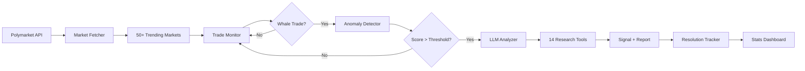

<div align="center">

# Polymarket Whale Watcher

**AI-powered whale trade surveillance for Polymarket prediction markets**

[](https://www.python.org/downloads/)
[](LICENSE)
[](https://docs.polymarket.com/)

Real-time monitoring | Multi-dimensional anomaly detection | LLM investigation with 14 autonomous tools | Signal accuracy tracking

[Quick Start](#-quick-start) | [How It Works](#-how-it-works) | [Features](#-features) | [Configuration](#-configuration) | [Dashboard](#-dashboard)

</div>

---

## What It Does

Whale Watcher continuously monitors 50+ trending Polymarket markets, detects large trades with anomalous patterns, and uses an LLM agent with 14 autonomous research tools to investigate whether the trader may possess an information advantage. It tracks signal accuracy over time, achieving **63.5% win rate** with **+28.3% average ROI** on high-confidence signals.

```
Trending Markets → Whale Detection → Anomaly Scoring → LLM Investigation → Signal Tracking
     (50+)          ($1k-$100k+)      (5 dimensions)    (14 tools, 5 rounds)  (win rate, ROI)
```

---

## Demo

<details open>
<summary><b>Terminal Output</b> — Real-time whale detection and analysis</summary>

```
$ python -m src.main run

╭──────────────────────────────────────────────────────────╮
│              🐋 Polymarket Whale Watcher                 │
│                                                          │
│  Markets Monitored:  50                                  │
│  Polling Interval:   15s                                 │
│  Min Trade Size:     $1,000                              │
│  Price Range:        0 - 0.7                             │
╰──────────────────────────────────────────────────────────╯

[14:22:51] 🐋 WHALE DETECTED on "Will MegaETH launch a token by June 30, 2026?"
           BUY Yes @ 0.4200 | $92,336 USDC | Wallet: 0x7a3b...f91e
           Anomaly Score: 0.78/1.00

[14:22:53] 🤖 LLM Analysis started (model: gemini-3-flash-preview)
           → Tool call: search_web("MegaETH token launch date 2026")
           → Tool call: search_twitter("MegaETH $METH token TGE")
           → Tool call: get_protocol_tvl("megaeth")
           → Tool call: get_contract_info("0x4f9b...2a1c")
           → Tool call: search_telegram("MegaETH launch")

[14:23:07] ✅ Analysis complete
           Information Asymmetry Score: 0.72 (HIGH)
           Recommendation: BUY Yes | Confidence: 0.75
           Report saved: reports/20260415/...

[15:00:00] 📊 Resolution check: 3 markets resolved
           → "EdgeX FDV above 400M" resolved YES — Signal CORRECT (ROI: +142%)
           → "Will Trump talk to Rutte" resolved NO — Signal INCORRECT
           → "Over 9M committed to P2P" resolved YES — Signal CORRECT (ROI: +67%)
```

</details>

<details>
<summary><b>Analysis Report</b> — LLM investigation with autonomous tool-use</summary>

Each whale trade generates a detailed markdown report:

- **Trade details** — amount, direction, price, trader wallet
- **Trader profile** — leaderboard rank, PnL, history, recent trades
- **LLM investigation** — autonomous tool calls (web, Twitter, Telegram, on-chain, DeFi)
- **Information asymmetry assessment** — score, evidence, reasoning

Example finding:
> *"New ERC-20 contract deployed by MegaETH deployer wallet 6 hours before trade — not yet publicly announced. KOL tweets about insider knowledge preceded the trade by ~3 hours."*
>
> **Information Asymmetry Score: 0.72** | Trader Credibility: HIGH

See full example: [docs/examples/sample_report.md](docs/examples/sample_report.md)

</details>

<details>
<summary><b>Daily Briefing</b> — Automated intelligence summary</summary>

Daily briefings include:
- High-confidence signals with analysis
- Price volatility alerts
- Historical signal performance (win rate, ROI by confidence tier)

| Metric | Value |
|--------|-------|
| Win Rate | **63.5%** |
| Avg ROI | **+28.3%** |
| Signals with IAS >= 60% | 3 today |

See full example: [docs/examples/sample_briefing.md](docs/examples/sample_briefing.md)

</details>

---

## Quick Start

### One-Click Setup

```bash
git clone https://github.com/chaoleiyv/polymarket-whale-watcher.git
cd polymarket-whale-watcher
chmod +x setup.sh && ./setup.sh
```

The setup script will:
1. Check Python 3.10+ is installed
2. Create a virtual environment
3. Install all dependencies
4. Create `.env` from template

Then add your API key and start:

```bash
# Add your Gemini API key (the only required key)
echo "GEMINI_API_KEY=your_key_here" >> .env

# Activate the environment and run
source venv/bin/activate
python -m src.main run
```

> **Get a free Gemini API key**: https://aistudio.google.com/apikey

### Docker

```bash
docker build -t whale-watcher .
docker run --env-file .env -v ./data:/app/data -v ./reports:/app/reports whale-watcher
```

### Make Commands

```bash
make setup       # One-click setup
make run         # Start monitoring
make run-debug   # Start with debug logging
make dashboard   # Start web dashboard
make markets     # View trending markets
make briefing    # Generate today's briefing
make help        # Show all commands
```

---

## Features

| Feature | Description |
|---------|-------------|
| **Real-Time Monitoring** | Parallel per-market polling of 50+ trending markets |
| **Anomaly Detection** | 5-dimensional scoring: size, price uncertainty, time-of-day, trader deviation, cluster signals |
| **Trader Profiling** | Leaderboard ranking, PnL, trading history, recent behavior |
| **LLM Analysis** | 14 autonomous tools across 5 rounds of investigation |
| **Signal Tracking** | Automatic market resolution checking, win rate stats by confidence tier |
| **Daily Briefing** | Automated 10:00 AM summary with high-confidence signals |
| **Email Alerts** | Real-time notifications for high information-asymmetry signals (>= 60%) |
| **Web Dashboard** | FastAPI-based signal performance dashboard |
| **Official API** | Works with Polymarket's public API — no private API access needed |

### 14 LLM Research Tools

The LLM agent autonomously selects and uses these tools during investigation:

| Category | Tools |
|----------|-------|
| **Social Sentiment** | `search_twitter`, `search_telegram`, `search_web` |
| **Crypto Data** | `get_crypto_price`, `get_defi_metrics`, `get_token_unlocks` |
| **Financial Data** | `get_stock_price`, `get_economic_indicators` |
| **On-Chain** | `get_wallet_transactions`, `get_contract_info` |
| **Legislation** | `search_congress` |
| **Market Data** | `get_market_history`, `get_trader_positions` |

---

## How It Works



### Pipeline

1. **Market Selection** — Fetches top trending markets by 24h volume from Polymarket, filters out sports/weather/short-term price markets, refreshes every 15 minutes

2. **Trade Monitoring** — Runs parallel async tasks per market, polls for new trades incrementally, deduplicates by transaction hash

3. **Anomaly Detection** — Multi-dimensional scoring on 5 axes:
   - **Size** — Trade size relative to market 24h volume
   - **Price uncertainty** — Closer to 0.5 = more interesting
   - **Time-of-day** — ET hour-based suspicion weights
   - **Trader deviation** — Trade size vs trader's historical average
   - **Cluster signal** — Same-direction trades within 5-minute window

4. **LLM Investigation** — Builds rich context (trade + trader profile + market data), LLM autonomously uses tools to investigate (up to 5 rounds), produces structured recommendation with information asymmetry score

5. **Signal Tracking** — Resolution tracker checks every 30 minutes for resolved markets, validates signal correctness, computes theoretical ROI, aggregates win rates by confidence tier

---

## Configuration

Copy `.env.example` to `.env` and configure:

### Required

| Variable | Description | Get It |
|----------|-------------|--------|
| `GEMINI_API_KEY` | Gemini API key for LLM analysis | [Google AI Studio](https://aistudio.google.com/apikey) |

### Trade Data Source

| Variable | Default | Description |
|----------|---------|-------------|
| `TRADE_API_MODE` | `official` | `official` = Polymarket public API (no auth needed), `internal` = private API |

The bot works out of the box with Polymarket's official public API. No private API access required.

### Optional (enhances analysis)

| Variable | Description | Get It |
|----------|-------------|--------|
| `TAVILY_API_KEY` | Web search (primary) | [tavily.com](https://tavily.com) |
| `TWITTER_API_KEY` | Twitter sentiment search | [Twitter Developer](https://developer.twitter.com) |
| `POLYGON_API_KEY` | Stock/ETF/forex data | [polygon.io](https://polygon.io) |
| `FRED_API_KEY` | Economic indicators | [FRED](https://fred.stlouisfed.org/docs/api/api_key.html) |
| `ETHERSCAN_API_KEY` | On-chain wallet analysis | [etherscan.io](https://etherscan.io/apis) |
| `CONGRESS_API_KEY` | US legislation data | [congress.gov](https://api.congress.gov/) |

### Whale Detection Tuning

| Variable | Default | Description |
|----------|---------|-------------|
| `MIN_TRADE_SIZE_USD` | `1000` | Minimum trade size to consider |
| `MIN_PRICE` / `MAX_PRICE` | `0` / `0.7` | Price range filter |
| `FETCH_INTERVAL_SECONDS` | `15` | Polling interval per market |
| `TRENDING_MARKETS_LIMIT` | `50` | Number of markets to monitor |

---

## Commands

```bash
# Core
python -m src.main run [--debug]              # Start monitoring
python -m src.main check-markets --limit 20   # View trending markets
python -m src.main test-analyze <market_id>   # Test LLM on a specific market

# Reports
python -m src.main briefing --today           # Generate today's briefing
python -m src.main briefing --date 2026-04-17 # Briefing for a specific date

# Dashboard
python -m src.main dashboard --port 8000      # Start web dashboard

# Maintenance
python -m src.main migrate                    # Migrate legacy JSON to SQLite
```

---

## Dashboard

Start the web dashboard to view signal performance:

```bash
python -m src.main dashboard
# Open http://localhost:8000
```

The dashboard shows:
- Overall signal statistics (total signals, win rate, avg ROI)
- Performance breakdown by confidence tier
- Top best/worst signals by theoretical ROI
- Paginated signal history

---

## Project Structure

```
src/
├── config/settings.py              # Environment configuration (Pydantic)
├── models/                         # Data models
│   ├── market.py                   # Market, TrendingMarket
│   ├── trade.py                    # TradeActivity, WhaleTrade, TraderRanking
│   ├── decision.py                 # TradeRecommendation, LLMDecision
│   └── anomaly_signal.py           # AnomalySignal (stored signal)
├── services/                       # Business logic (23 modules)
│   ├── market_fetcher.py           # Polymarket Gamma API
│   ├── trade_monitor.py            # Per-market parallel monitoring (official + internal API)
│   ├── anomaly_detector.py         # Multi-dimensional anomaly scoring
│   ├── llm_analyzer.py             # LLM with tool-use (14 tools, 5 rounds)
│   ├── tools.py                    # Tool registry
│   ├── resolution_tracker.py       # Market resolution checking
│   ├── stats_engine.py             # Performance statistics
│   ├── daily_briefing.py           # Daily summary generation
│   └── [data services]             # Twitter, Telegram, CoinGecko, DeFiLlama,
│                                   # FRED, Polygon, Etherscan, Congress, web search
├── db/database.py                  # SQLite signal storage
├── prompts/                        # LLM system prompts & tool schemas
├── dashboard.py                    # FastAPI web dashboard
└── main.py                         # CLI entry point (Typer)
```

---

## Architecture

```
                    ┌─────────────────────────────┐
                    │    Polymarket Gamma API      │
                    │  (trending markets, prices)  │
                    └──────────────┬──────────────┘
                                   │
                    ┌──────────────▼──────────────┐
                    │       Market Fetcher         │
                    │  (filter sports/weather/etc) │
                    └──────────────┬──────────────┘
                                   │
              ┌────────────────────▼────────────────────┐
              │         Trade Monitor (async)           │
              │  50+ parallel market polling tasks      │
              │  Official API ←→ Internal API (switch)  │
              └────────────────────┬────────────────────┘
                                   │
              ┌────────────────────▼────────────────────┐
              │         Anomaly Detector                │
              │  5-axis scoring: size, price, time,     │
              │  trader deviation, cluster signals      │
              └────────────────────┬────────────────────┘
                                   │
              ┌────────────────────▼────────────────────┐
              │         LLM Analyzer (Gemini)           │
              │  14 tools × 5 rounds of investigation   │
              ├─────────┬────────┬────────┬─────────────┤
              │ Twitter │  Web   │ DeFi   │  On-Chain   │
              │Telegram │ Search │ Crypto │  Congress   │
              └─────────┴───┬────┴────────┴─────────────┘
                            │
              ┌─────────────▼──────────────────────────┐
              │     Signal Storage (SQLite)             │
              │  → Resolution Tracker (every 30min)    │
              │  → Stats Engine (win rate, ROI)        │
              │  → Dashboard (FastAPI)                 │
              │  → Email Alerts (IAS >= 60%)           │
              └────────────────────────────────────────┘
```

---

## Safety

- Trade execution **disabled by default** (`ENABLE_TRADE_EXECUTION=false`)
- Position size capped at 20% of balance if enabled
- Minimum 60% confidence threshold for execution
- Price range filter avoids obvious outcomes
- All decisions logged for audit trail
- Rate limiting on all external APIs

## Disclaimer

This system is for research and educational purposes. Prediction market trading involves significant risk. Never trade with funds you cannot afford to lose. Always verify recommendations independently.

---

## License

MIT
